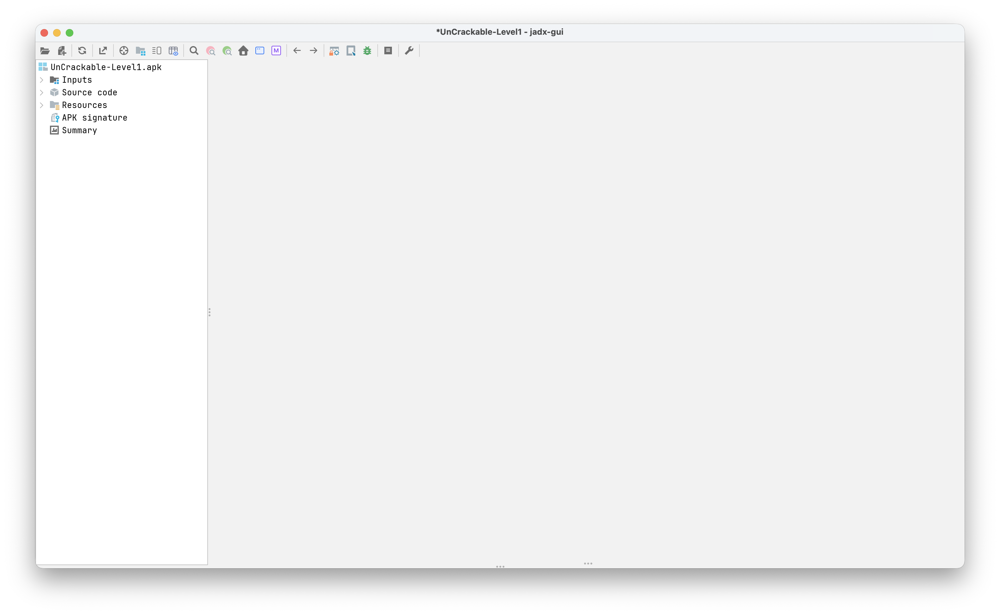
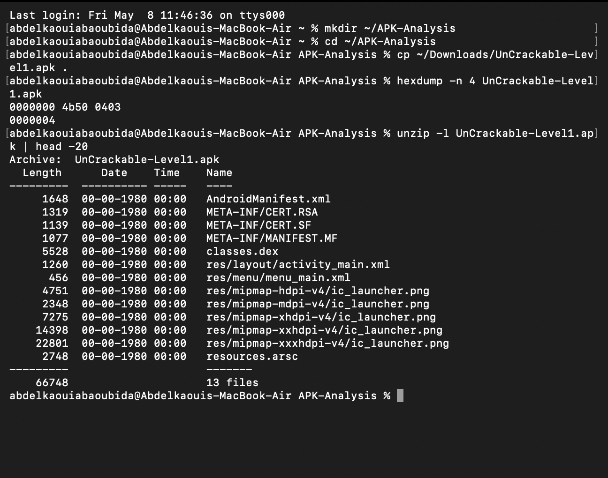
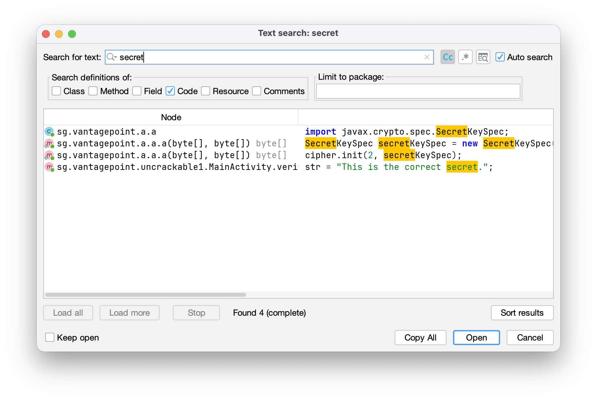
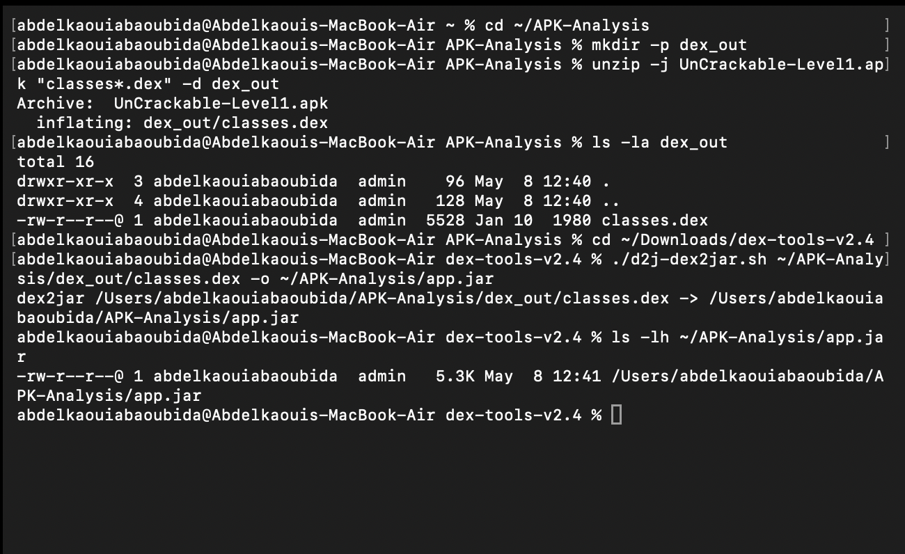
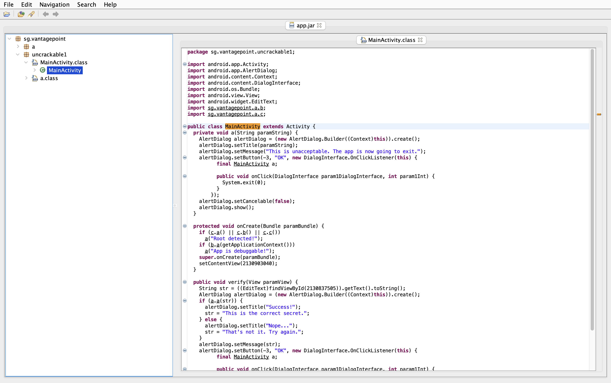

# LAB 4 — Analyse statique d’un APK avec JADX GUI + dex2jar + JD-GUI

## Objectif

Ce laboratoire a pour objectif d’analyser statiquement une application Android APK afin d’identifier sa structure interne, son code Java, ses mécanismes de sécurité et certaines informations sensibles présentes dans l’application.

Les outils utilisés sont :

- JADX GUI
- dex2jar
- JD-GUI

---

# Étape 1 — Vérification de l’APK

Cette étape permet de vérifier que le fichier APK est valide et qu’il contient bien une structure Android classique.

## Capture 1



### Explication

Dans cette capture :

- l’APK `UnCrackable-Level1.apk` est ouvert dans JADX GUI ;
- on observe la structure générale de l’application ;
- les dossiers `Resources`, `Source code` et `META-INF` sont visibles ;
- le fichier `AndroidManifest.xml` est présent ;
- le fichier `classes.dex` contenant le bytecode Android est identifié.

Cette étape confirme que l’APK peut être analysé correctement.

---

# Étape 2 — Inspection du contenu de l’APK

Cette étape permet de lister le contenu interne de l’APK directement depuis le terminal.

## Capture 2



### Explication

Dans cette capture :

- le dossier de travail `APK-Analysis` est créé ;
- l’APK est copié dans ce dossier ;
- la commande `hexdump` confirme que le fichier commence par la signature ZIP `PK` ;
- la commande `unzip -l` affiche le contenu de l’APK.

Les éléments importants observés :

- `AndroidManifest.xml`
- `classes.dex`
- `resources.arsc`
- dossiers `res/`
- fichiers de signature `META-INF`

Cela confirme que l’APK est une archive Android valide.

---

# Étape 3 — Recherche de chaînes sensibles

Cette étape consiste à rechercher des informations sensibles directement dans le code décompilé.

## Capture 3



### Explication

Dans cette capture :

- la fonction de recherche globale de JADX GUI est utilisée ;
- le mot-clé recherché est `secret`.

Les résultats montrent :

- l’utilisation de `SecretKeySpec` ;
- la présence de chaînes contenant le mot `secret` ;
- une chaîne affichée dans `MainActivity` :
  ```java
  "This is the correct secret."
  ```

Cette étape montre que certaines informations sensibles peuvent être retrouvées dans une analyse statique.

---

# Étape 4 — Conversion DEX vers JAR avec dex2jar

Cette étape permet de convertir le fichier `classes.dex` en fichier `.jar` afin d’utiliser un autre décompilateur Java.

## Capture 4



### Explication

Dans cette capture :

- le fichier `classes.dex` est extrait depuis l’APK ;
- l’outil `dex2jar` est utilisé ;
- la commande :
  ```bash
  ./d2j-dex2jar.sh ~/APK-Analysis/dex_out/classes.dex -o ~/APK-Analysis/app.jar
  ```
  convertit le bytecode Android en fichier JAR ;
- le fichier `app.jar` est généré avec succès.

Cette étape prépare l’analyse avec JD-GUI.

---

# Étape 5 — Analyse du fichier JAR avec JD-GUI

Cette étape permet d’analyser le code Java reconstruit à partir du fichier JAR.

## Capture 5



### Explication

Dans cette capture :

- le fichier `app.jar` est ouvert dans JD-GUI ;
- la classe `MainActivity` est affichée ;
- plusieurs mécanismes de sécurité sont visibles.

Les éléments importants observés :

### Détection Root

```java
if (c.a() || c.b() || c.c())
